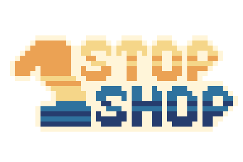

  
  
  <h1>Various customers, three shops to build one at a time.</h2>
  
  ## | [**Play the Game!**](https://mahyellaw.itch.io/one-stop-one-shop) |

## Project Summary. 📝

"One Stop, One Shop" is my game jam entry for Mini Jam 108(a game hackathon with a 72-hour timeframe), with the theme of **_Seaside_** and a limitaion of **_"Everything dies in one hit."_** The overall concept of this game was that the core mechanics are associated to 1; one shop can be built at a time, score values decrement and increment by 1, you get the point.

## Software and Technologies. 🔨

- [Godot Engine](https://godotengine.org)
- [Aseprite](https://www.aseprite.org)
- [BFXR](https://www.bfxr.net)

## Feedback. 💌

These game jam entries are what I often practice on. So your feedback really matters, feel free to hit me up or comment your thoughts. 🧡

<ul>
  
  <a href="https://discord.com">mahyellaw#3482</a>
   
  
  <a href="https://twitter.com/mahyellaw">@mahyellaw</a>
   
  
  <a href="https://twitter.com/mahyellaw">@mahyellawStudios</a>
</ul>

